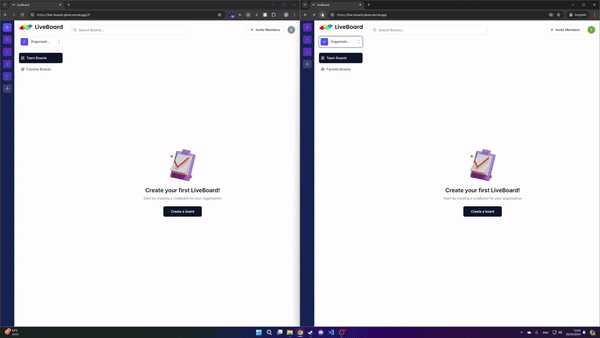
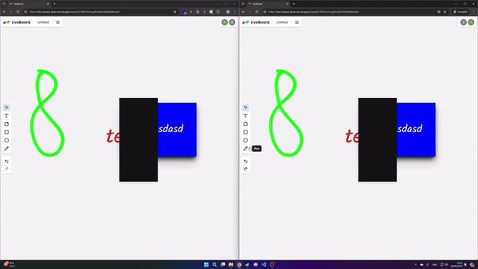

# [LiveBoard](https://live-board-plum.vercel.app/)

### https://live-board-plum.vercel.app/

## Description:
LiveBoard is a digital collaboration platform that helps teams and educators visualize ideas, brainstorm, and work together in real time, just like a digital whiteboard.

With intuitive interface the LiveBoard lets you create and join teams, invite other people, create, search and favorite whiteboards.

In the whiteboard there are many features such as a drawing pencil inserting shapes such as rectangles and ellipses, inserting sticky notes and plain text. Undo and redo buttons, color change, multi select, resize drag, keyboard shortcuts for navigation through the canvas, and for the undo and redo buttons and more.

## Systems Used:
• This website is built using [Next.js 13](https://nextjs.org/) using Typescript. 

• [tailwindcss](https://tailwindcss.com/)  and [shadcn/ui](https://ui.shadcn.com/) for the styling.

• [Convex](https://www.convex.dev/) for the realtime database

• [liveblocks](https://liveblocks.io/) for the collaboration rooms

• [Clerk](https://clerk.com/) for authentication, user and organization management

• Deployed on [Vercel](https://vercel.com/)

## Invitation:
<video controls='controls'>
<source src="./media/invitation.mp4" type="video/mp4"/>
</video>

## Board Actions:

 
